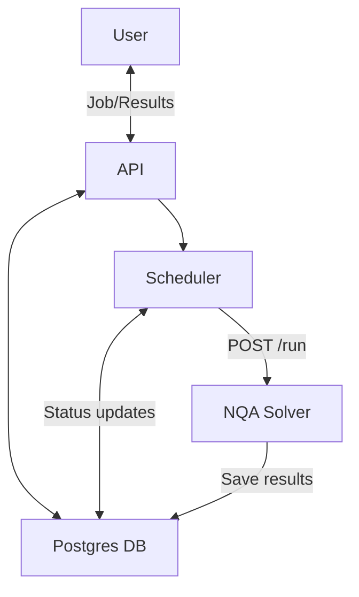

# Neural Quantum Annealer (NQA) Server

A microservices platform for solving **combinatorial optimization problems** (in Ising / QUBO formulation) and **quantum spin glasses** (transverse-field Sherrington-Kirkpatrick models) using variational quantum annealing with neural-network quantum states. Problems are submitted via a REST API or web UI; a GPU-accelerated solver optimizes them with automatic hyperparameter search via Optuna.

## Background

### Problem formulation

NQA solves problems expressed as an Ising Hamiltonian:

$H = \sum_{i<j} J_{ij}\sigma_i^z\sigma_j^z + \sum_i h_i\sigma_i^z + \sum_i g_i\sigma_i^x$

where $J_{ij}$ is the coupling matrix, $h_i$ the longitudinal field, and $g_i$ the transverse field.


## Architecture



**Data flow**

1. User uploads a problem (coupling matrix + optional fields + study parameters).
2. `api` writes files to `/data/jobs/{job_id}/` and inserts a `QUEUED` row in PostgreSQL.
3. `scheduler` claims the job (`RUNNING`), reads the files, and POSTs to `/solver/run`.
4. `solver` spawns `master.py`, which runs the Optuna study (CMA-ES → TPE).
5. `scheduler` marks the job `DONE` (or `FAILED`) and stores the response.
6. User downloads the result ZIP or opens the Optuna dashboard (`http://localhost:8001`).

## Prerequisites

- [Docker](https://docs.docker.com/get-docker/) with Compose v2
- NVIDIA GPU with drivers installed
- [`nvidia-container-toolkit`](https://docs.nvidia.com/datacenter/cloud-native/container-toolkit/install-guide.html)

## Quick Start

### Build and start all services

```bash
docker compose up --build
```

and connect the web UI at http://localhost:8000.

## Web UI & REST API

### Submitting a job

Open http://localhost:8000 in a browser, fill in the form, and upload your problem files. 

### Key endpoints

| Method | Endpoint | Description |
|---|---|---|
| `GET` | `/` | Web UI (problem upload form) |
| `POST` | `/upload` | Submit a new job |
| `GET` | `/jobs` | List all jobs |
| `GET` | `/jobs/{id}` | Job status and metadata |
| `GET` | `/jobs/{id}/download` | Download results as ZIP |
| `GET` | `/jobs/{id}/dashboard` | Optuna dashboard for this job |
| `GET` | `/jobs/{id}/optuna-db` | Download raw Optuna SQLite DB |

## Standalone Solver CLI

The solver can be used **independently of the server stack** — no Docker or PostgreSQL required.

### Install dependencies

```bash
pip install -r services/solver/requirements.txt
```

> A CUDA-capable GPU and a compatible JAX installation are assumed.

### Run

```bash
python services/solver/nqa/master.py --J_matrix_path <path/to/J.npy> [options]
```

### Arguments

#### Problem definition

| Argument | Type | Default | Description |
|---|---|---|---|
| `--J_matrix_path` | str | **required** | Path to coupling matrix `.npy` |
| `--h_vector_path` | str | — | Longitudinal field vector `.npy` |
| `--g_vector_path` | str | — | Transverse field vector `.npy` (enables quantum mode) |
| `--energy_shift` | float | `0.0` | Constant added to the objective |

#### Study / Optuna

| Argument | Type | Default | Description |
|---|---|---|---|
| `--study_name` | str | timestamp | Optuna study identifier |
| `--db_storage_path` | str | `studies/<name>/optuna_db.db` | SQLite storage path |
| `--num_trials` | int | `100` | Total Optuna trials (80 % CMA-ES + 20 % TPE) |
| `--num_workers` | int | `1` | Parallel trial workers |
| `--trial_max_runtime` | int | `7200` | Max seconds per trial |
| `--target_objective_value` | float | `-1e5` | Early-stop threshold |

#### VQA (search ranges passed to Optuna)

| Argument | Type | Default | Description |
|---|---|---|---|
| `--vqa_num_annealing_steps_min/max` | int | `10000` / `1000000` | Annealing step range |
| `--vqa_num_updates_per_step_min/max` | int | `1` / `3` | SR updates per annealing step |
| `--vqa_annealing_field_scale_min/max` | float | `0.1` / `10.0` | Annealing field scale range |
| `--vqa_catalyst_field_scale_min/max` | float | `0.1` / `10.0` | Catalyst field scale range |
| `--vqa_num_replicas` | int | `1` | Parallel VQA replicas per trial |

#### Optimizer (SGD with momentum)

| Argument | Type | Default | Description |
|---|---|---|---|
| `--sgd_learning_rate_min/max` | float | `1e-3` / `1.0` | Learning rate search range |
| `--sgd_momentum_min/max` | float | `0.0` / `0.9` | Momentum search range |

#### Stochastic Reconfiguration

| Argument | Type | Default | Description |
|---|---|---|---|
| `--sr_diagonal_shift_min/max` | float | `1e-9` / `1e-2` | FIM diagonal regularization range |

#### Deep Boltzmann Quantum State (DBQS)

| Argument | Type | Default | Description |
|---|---|---|---|
| `--dbqs_num_hidden_layers` | int | `2` | Number of hidden layers |
| `--dbqs_unit_density_per_layer_min/max` | float | `0.5` / `2.0` | Hidden units per spin (search range) |

#### MCMC sampling

| Argument | Type | Default | Description |
|---|---|---|---|
| `--mcmc_num_samples_min/max` | int | `128` / `1024` | Samples per observable estimation |
| `--mcmc_num_sweep_steps_min/max` | int | `16` / `1024` | Gibbs sweep steps |

#### Hardware

| Argument | Type | Default | Description |
|---|---|---|---|
| `--cuda_device` | int | `0` | GPU index |

### Examples

**Minimal — classical optimization:**

```bash
python services/solver/nqa/master.py \
  --J_matrix_path problem/J.npy
```

**Full — quantum spin glass with custom search ranges:**

```bash
python services/solver/nqa/master.py \
  --J_matrix_path problem/J.npy \
  --g_vector_path problem/g.npy \
  --study_name tfsk_run_01 \
  --num_trials 200 \
  --vqa_num_annealing_steps_min 50000 \
  --vqa_num_annealing_steps_max 500000 \
  --sgd_learning_rate_min 1e-3 \
  --sgd_learning_rate_max 1e-1 \
  --dbqs_num_hidden_layers 2 \
  --vqa_num_replicas 3 \
  --num_workers 4 \
  --cuda_device 0
```

Results and the Optuna SQLite database are written to `studies/<study_name>/`. Open the dashboard with:

```bash
optuna-dashboard sqlite:///studies/tfsk_run_01/optuna_db.db
```

## Input Formats

### Ising (native)

| File | Shape | Required |
|---|---|---|
| `J.npy` | `(N, N)` float, symmetric | Yes |
| `h_vector.npy` | `(N,)` float | No (defaults to zero) |
| `g_vector.npy` | `(N,)` float | No — if provided, enables quantum mode |

### QUBO

Upload a `Q.npy` matrix of shape `(N, N)`. The API automatically converts it to Ising form via:

$$J_{ij} = Q_{ij}/4, \quad h_i = \frac{1}{2}\sum_j Q_{ij}, \quad C = \text{const}$$

## Benchmarks

The methods implemented in this repository were evaluated on the following problem classes (see `paper/`):

| Problem | Size | Type |
|---|---|---|
| Sherrington-Kirkpatrick (SK) | 16, 100, 200 spins | Classical spin glass |
| Transverse-field SK (TFSK) | 16, 100 spins | Quantum spin glass |
| Job Shop Scheduling (JSSP) | Various | Combinatorial optimization |

Benchmark instances and hyperparameter optimization data are in `paper/Data/`. Figure generation scripts are in `paper/Figures/`.

## Paper

The scientific methodology behind this repository is described in:

> `paper/paper.pdf`

The paper covers the DBQS ansatz, the VQA algorithm, stochastic reconfiguration variants, and benchmark results on SK, TFSK, and JSSP instances.

## Acknowledgements

This project relies on the following open-source libraries:

- **[JAX](https://github.com/google/jax)** — high-performance numerical computing and automatic differentiation on GPU/TPU, which powers the variational quantum annealing solver.
- **[Optuna](https://github.com/optuna/optuna)** — automatic hyperparameter optimization framework used to tune the VQA and MCMC parameters across trials.
