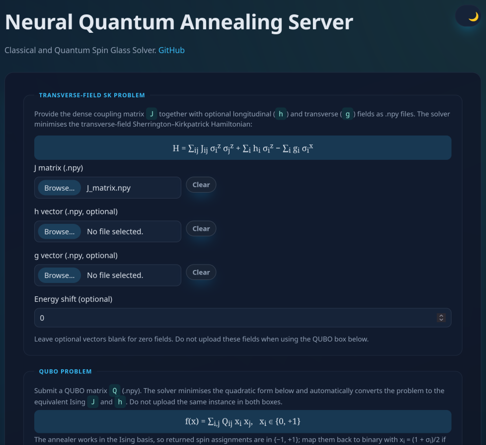
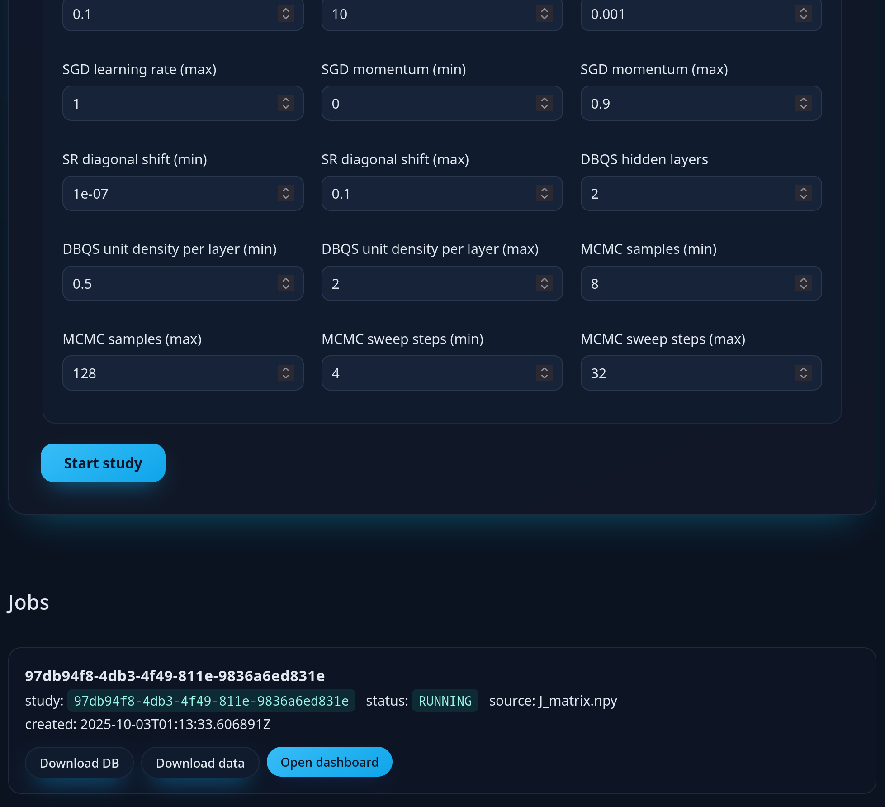
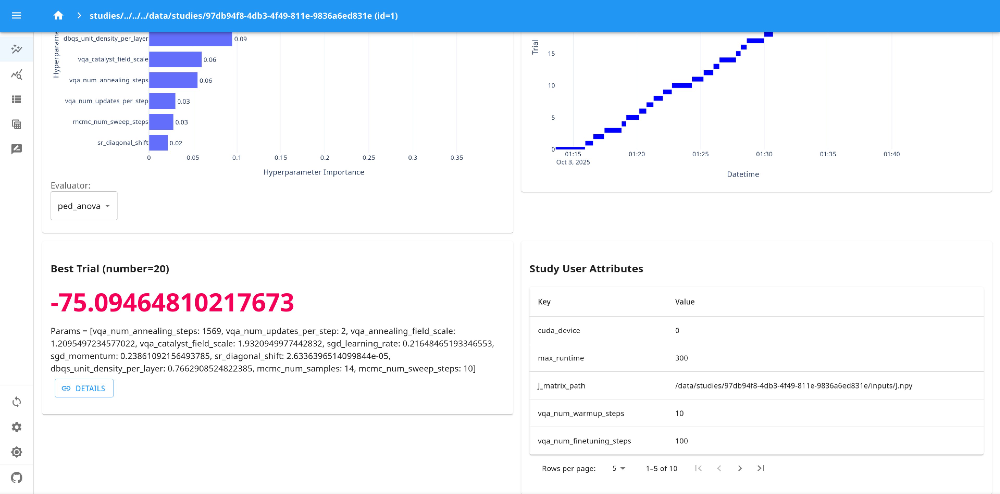
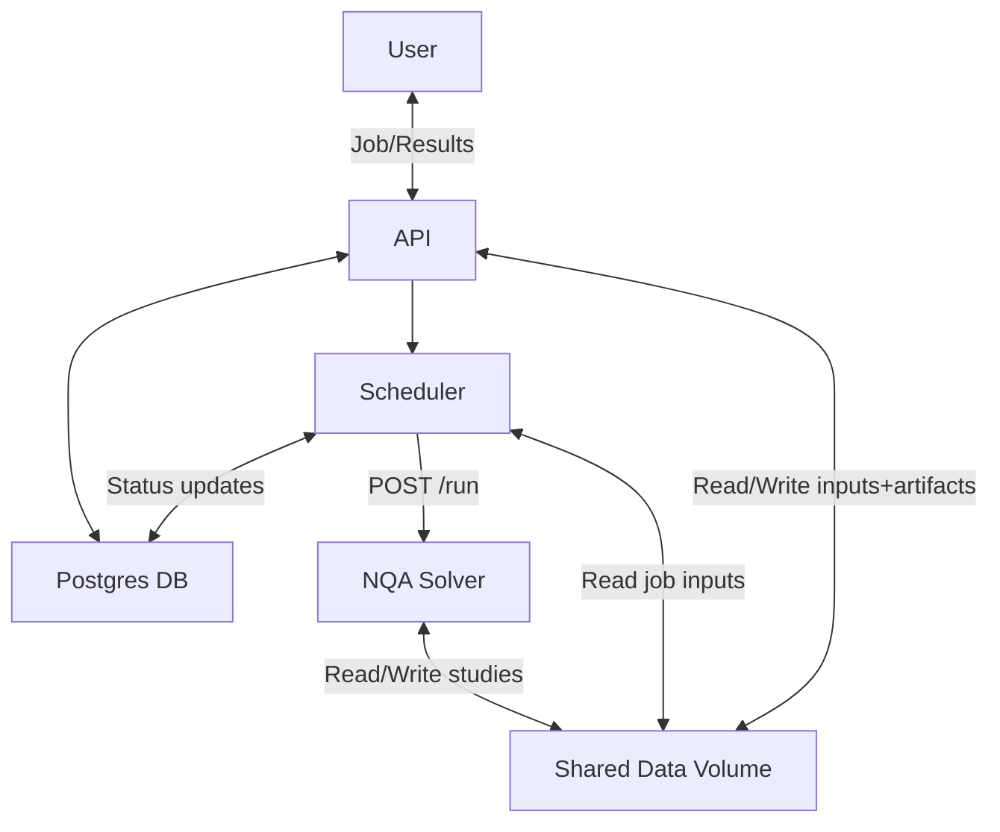

# Neural Quantum Annealing Server

A self-contained platform that runs Neural Quantum Annealing (NQA) experiments behind a simple web dashboard. You drop in Ising or QUBO matrices, the system schedules a run on a GPU-enabled solver, and you can follow along from your browser.

Note: it is also possible to download only the solver code in services/solver and run it directly in a Python environment with GPU access. 

**Project highlights**
- End-to-end workflow: upload problem → schedule run → download results.
- Friendly web UI plus REST API for automation.
- GPU-ready solver powered by JAX and Optuna for hyper-parameter search.
- Everything ships as containers so you can launch the full stack with a single command.

## What Is Neural Quantum Annealing?
Neural Quantum Annealing (NQA) is the hybrid optimisation strategy introduced in `paper/paper.pdf`. It blends the adiabatic schedule of quantum annealing with neural-network wavefunctions called Deep Boltzmann Quantum States. The method starts from an easy reference Hamiltonian, gradually morphs it into the target Ising or QUBO problem, and repeatedly re-optimises the neural state with natural-gradient updates so the ground state is tracked throughout the sweep. This combination delivers exact ground states for large spin-glass instances while staying entirely in classical GPU-friendly software.

## Containers in a Nutshell
If you are new to Docker: think of a container as a lightweight mini-computer that bundles the code and its dependencies. Running `docker compose up` starts the database, API, scheduler, and solver containers together so you do not have to install each piece manually. Data persists in Docker volumes (`pgdata` and `shared-data`) across restarts unless you remove them.

## Before You Start

### Hardware
- 1 NVIDIA GPU with a recent driver (the solver image tracks `nvcr.io/nvidia/jax:25.08-py3`).
- 16 GB of system RAM recommended.
- At least 10 GB of free disk space for Docker images and study artefacts.

### Software to Install
1. **Docker Desktop (Windows/macOS)** or **Docker Engine (Linux)** – follow the official [Docker installation guide](https://docs.docker.com/get-docker/).
2. **Docker Compose plugin** – bundled with Docker Desktop; on Linux follow the [Compose install steps](https://docs.docker.com/compose/install/).
3. **NVIDIA Container Toolkit** – required so Docker containers can see your GPU. Installation instructions live in the [NVIDIA docs](https://docs.nvidia.com/datacenter/cloud-native/container-toolkit/install-guide.html).
4. **Git** (optional) – only needed if you prefer cloning over downloading the repository as a zip.

### Confirm Your Setup
Run these quick checks in a terminal/powershell:

```bash
docker --version
docker compose version
nvidia-smi
```

All three should print version information. If `nvidia-smi` fails, verify your GPU driver installation before proceeding.

## Getting the Code
```bash
git clone <repo-url>
cd nqa_server
```
If you downloaded a zip, extract it and open the repository root (the folder containing `docker-compose.yml`).

## Configure Environment Defaults
The application reads connection details and solver defaults from `.env`.

Edit the checked-in `.env` to match your environment (it ships with working defaults so you can start immediately). At minimum review the PostgreSQL password and the Optuna defaults (`HPO_DEFAULT_*`). These settings appear in the upload form and API responses. The bundled defaults mirror presets tuned for a laptop-class GPU (RTX 3060 Mobile) targeting classical spin-glass and QUBO instances in the 300-400 variable range. For quantum ground-state workloads you will generally need to raise the sampling-related knobs (more samples, longer sweep steps, additional workers) to obtain high-fidelity approximations.

## Start the Platform (First Run)
1. **Build the Docker images** – this downloads the base CUDA image and installs Python dependencies. The solver image can take several minutes to pull the first time.
   ```bash
   docker compose build
   ```
2. **Launch the stack** – this starts the database, API, scheduler, and solver in the foreground so you can see logs.
   ```bash
   docker compose up
   ```
   Leave this terminal open while you use the system. When everything is ready you will see log lines announcing that the API is listening on port 8000.
3. **Visit the web UI** – open a browser and navigate to `http://localhost:8000`.
   - Upload `.npy` matrices (Ising `J` with optional `h`/`g`, or QUBO `Q`).
     - For Ising problems you may also supply uniform scalar fields via `h_value` / `g_value` instead of full vector files; the scheduler expands them automatically.
     - For QUBO problems the `h` field is computed automatically from the matrix and cannot be supplied separately.
   - Optionally set a job name or target objective value to annotate the run.
   - Adjust Optuna search bounds or accept the defaults from `.env`.
   - Submit the job and monitor its status from the same page.

4. **Optional: open the Optuna dashboard directly** – the API also exposes the dashboard service on port `8001`.
   - Base URL: `http://localhost:8001`
   - Per-job launch endpoint: `GET /jobs/{job_id}/dashboard` on the API (`http://localhost:8000`).
   - Only one dashboard process runs at a time. Requesting a dashboard for a new job automatically replaces the previous instance.

### UI Preview
The front-end walks you through each stage:







## Everyday Tasks
- **Stop the services**: press `Ctrl+C` in the `docker compose up` window, or run `docker compose down` from another terminal.
- **Restart in the background**: `docker compose up -d` starts everything detached; use `docker compose logs -f` to follow logs.
- **Check GPU visibility**: `docker compose exec solver nvidia-smi` should mirror the host output.
- **Update to the latest code**: pull new changes (`git pull`) and rebuild the images with `docker compose build --pull`.

## Where Your Data Lives
Job inputs and solver outputs are stored in the Docker named volume `shared-data` (mounted at `/data` inside API, scheduler, and solver containers). Job metadata is stored in PostgreSQL's `pgdata` volume.

Inside the shared volume, data is structured as:

```
shared-data volume
├── jobs/<job_id>/
│   ├── J.npy
│   ├── h_vector.npy
│   ├── g_vector.npy
│   ├── qubo_matrix.npy
│   └── study_request.json
└── studies/<study_name>/
    ├── optuna_db.db
    ├── test_<trial>/
    └── inputs/
```

By default the study directory is named after the job ID; supplying a custom study name in the upload form stores results under `studies/<your-name>`. When you download a finished job from the UI the zip contains the corresponding study directory.

To inspect where Docker stores the named volume on your machine:

```bash
docker volume inspect nqa_server_shared-data
docker volume inspect nqa_server_pgdata
```

## Architecture Overview
At runtime four containers collaborate:

- **API (`services/api`)**: FastAPI application serving the browser UI and REST endpoints. Also proxies Optuna Dashboard so you can inspect studies live.
- **Scheduler (`services/scheduler`)**: Polls the database for queued jobs, requests runs from the solver, and updates job status.
- **Solver (`services/solver`)**: Launches `nqa/master.py`, streams logs, and writes Optuna artefacts under `/data/studies/<study_name>`.
- **PostgreSQL (`db`)**: Persists job metadata, statuses, and error messages.
- **Shared data volume (`shared-data`)**: Stores uploaded matrices, generated inputs, and Optuna study outputs.

## Repository Tour
- `docker-compose.yml` – wiring between services, shared volumes, and environment variables.
- `.env` – default credentials and Optuna parameters surfaced in the upload form.
- `services/api` – FastAPI UI + REST API implementation.
- `services/scheduler` – background polling worker.
- `services/solver` – solver service, JAX/Optax code (`nqa/`), and container definition. See `services/solver/README.md` for solver-specific notes.
- `shared-data` (Docker volume) – persistent storage for job inputs and study outputs.
- `docs/` – deeper service documentation (`api.md`, `scheduler.md`, `solver.md`).
- `paper/` – reference material and research utilities, including `paper/nqa/utils/` with the original research code used to produce the paper results (distinct from the production solver under `services/solver/nqa/`).

## API Quick Reference
- `GET /` – upload and monitoring UI.
- `POST /upload` – submit an Ising (`J.npy`) or QUBO (`qubo_matrix.npy`) job, plus optional metadata and study args.
- `GET /jobs` – list all jobs.
- `GET /jobs/{job_id}` – get one job's status.
- `GET /jobs/{job_id}/download` – download study artifacts as zip (for `RUNNING`/`DONE`).
- `GET /jobs/{job_id}/dashboard` – return the Optuna dashboard URL for that job.
- `GET /jobs/{job_id}/optuna-db` – download `optuna_db.db` for that job.

## Day-to-Day Operations
- **Follow logs**: `docker compose logs -f api` (or `scheduler`, `solver`, `db`).
- **Check solver health**: `curl http://localhost:8081/health` should return `{"status":"ready"}`.
- **Inspect the database**: `docker compose exec db psql -U $POSTGRES_USER $POSTGRES_DB` opens a psql shell. The `jobs` table records the latest status and any error snippet.
- **Inspect persistent volumes**: `docker volume ls | grep nqa_server`.
- **Clean all persistent data**: `docker compose down -v` removes containers and named volumes (irreversible).

## Developing and Extending
Interested in modifying or extending the solver?
- Run the services individually outside Docker if you have a Python 3.11 environment:
   - API (from `services/api`): `uvicorn app.main:app --reload --port 8000` (configure `DATABASE_URL`, `DATA_ROOT`, `OPTUNA_DASHBOARD_BIND_HOST`, and `OPTUNA_DASHBOARD_PORT`).
   - Solver (from `services/solver`): `uvicorn nqa.main:app --reload --port 8081` (set `DATA_ROOT`, `NQA_MASTER_SCRIPT`, and ensure GPU access).
   - Scheduler (from `services/scheduler`): `python -m app.main` (needs `DATABASE_URL`, `SOLVER_URL`, and `DATA_ROOT`).
- Tests: inside `services/solver/nqa`, execute `python -m pytest -q`. Some tests require CUDA.
- Formatting/linting: integrate `ruff`, `black`, or your preferred tools—no strict configuration ships with the repo.

## Troubleshooting Guide
| Symptom | Likely Cause | Fix |
|---------|--------------|-----|
| API page does not load | Containers still starting or failed | Check `docker compose logs` for errors; ensure port 8000 is free. |
| Solver job fails immediately | GPU unavailable inside container | Confirm `docker compose exec solver nvidia-smi` works; reinstall NVIDIA Container Toolkit if needed. |
| Upload rejected | Files not in `.npy` format or invalid dimensions | Save matrices as NumPy arrays; leave optional fields blank if unused. |
| Jobs stuck in `QUEUED` | Scheduler cannot reach solver | Verify solver logs and `curl http://localhost:8081/health`. |
| Long-running jobs block others | No timeout configured | Add `SOLVER_TIMEOUT=<seconds>` to `.env` (not set by default) to abort after a chosen duration. |
| Optuna dashboard link fails | Port 8001 blocked or dashboard dependency unavailable | Confirm `optuna-dashboard` is installed in API image and that port 8001 is exposed. |
| Want to start fresh | Stale data in named volumes | Run `docker compose down -v` (removes *all* data). |

## Additional Resources
- `docs/api.md` – endpoint reference and payload shapes.
- `docs/scheduler.md` – how the polling loop works and retry behaviour.
- `docs/solver.md` – solver internals, CUDA configuration, and Optuna runner details.

Contributions and suggestions are welcome—open an issue or submit a PR if you have improvements to share.

## Acknowledgements
- Built on the [Optuna](https://optuna.org/) optimisation framework and the [Optuna Dashboard](https://github.com/optuna/optuna-dashboard).
- CUDA-enabled base image courtesy of NVIDIA’s JAX container.
